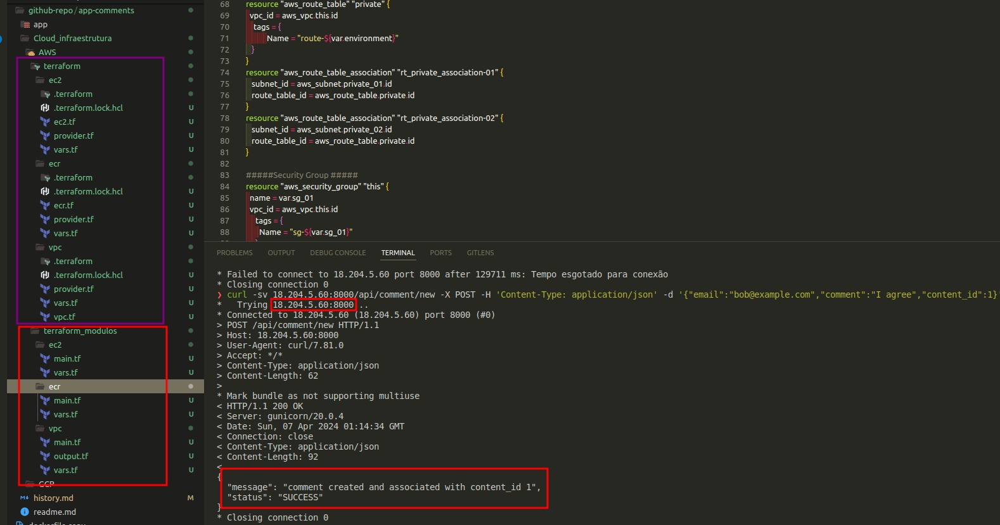
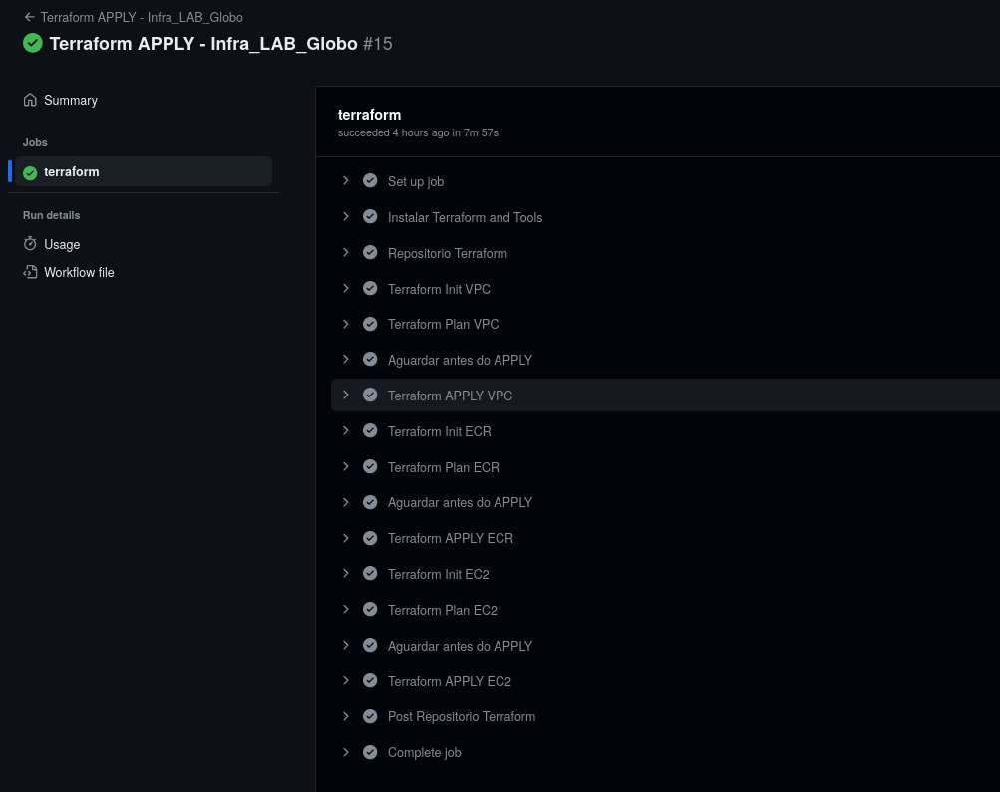

### Desenvolvimento do LAB

**Validação da aplicação**

> Realizar a conteinerização  da Aplicação
> 
> 1. Efetuado a criação do arquivo Dockerfile dentro do diretorio **app**  para criar a imagem da aplicação
>     - [ ]  Utilizando a imagem BASE "alpine" para construção da imagem 
>    - [ ]  Adicionado aos comandos de inicialização o "bind" para **0.0.0.0:8000**, essa adição foi devido ao comandos para testar o funcionamento da aplicação ocorriam somente internos no container 
>      
**Buildando a Imagem**
>    ```bash
>    docker build -t <nome_da_imagem> .     
> ``` 
  Obs: o ponto **( . )** ao final do comando se refere a copiar todo o diretorio para dentro da imagem
>          
- Apos a criação da imagem executar o container para efetuar testes
    
    ```bash
    docker run -dti -p 8000:8000 --name <nome_do_container> <nome_da_imagem_buildada>
    ```
    
    ---

**Iniciando Estrutura pata Terraformar Recursos**

Realizado a criação de Modulos para serem reutilizados
→ Efetuado todo processo de criação da Infra primeiro com os comando locais para validação antes de inserir em uma automação em Pipeline.
→  Será utilizado a solução GitHub Action.

O Processo de construção da Infra na AWS foi de forma a utilizar o Free-Tier então ocorreram adaptações para disponibilizar a aplicação .
 Foi realizado a construção dos modulos sem inserir nada Hard-COde ( com valores fixos  nos modulos) estamente para o o uso em futuros projetos.



-------------------------------------------------------------------------------------------------------------
Realizado via Pipeline a construção da Infraestrutura via Terraform.



Foi realizado alguns ajustes mas devido ao tempo para executar o Desafio (consegui apenas o sabado e Domingo) sem desculpa pelo tempo acabei enfrentando alguns desafios que demandaram tempo no Github Actions.

Nao consegui fazer a ideia geral da estrutura, mas seria.

Vis Push e atualizações na Branch Main o Build da imagem nova e a atualização do COntainer direto na EC2.


GOstaria de ter tdo mais tempo para desenhar o pequeno projeto e como poderia ficar em uma estrutura ECS, pois acabei adaptando algumas configurações com EC@.

Agradeço pelo Desafio.